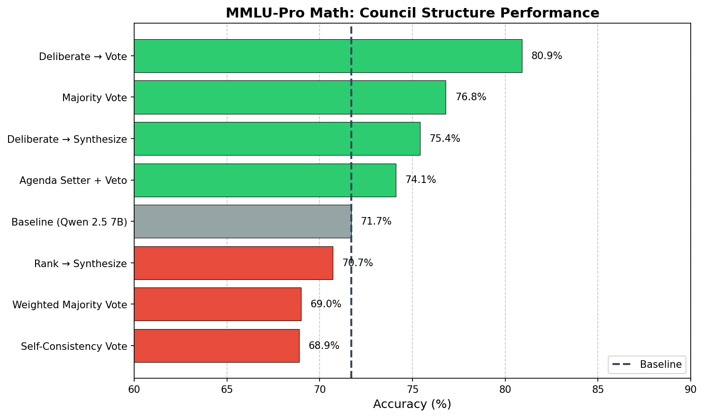
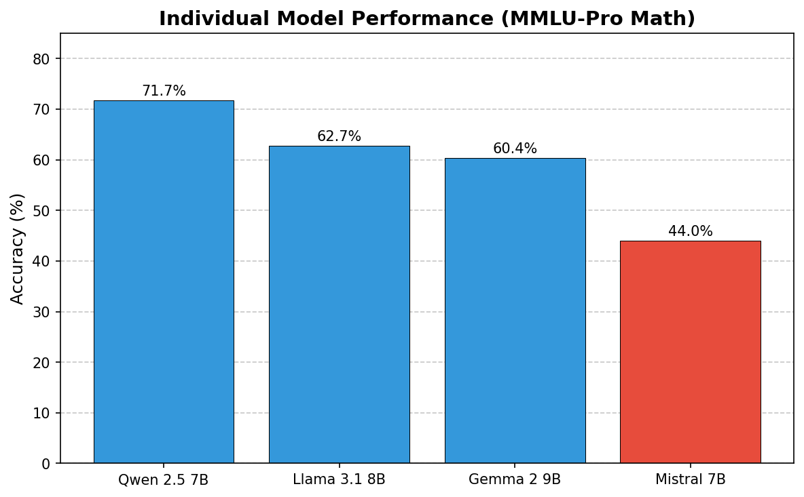

# LLM Council Governance Study

An experimental framework comparing different governance structures for LLM councils. Extends [Karpathy's llm-council](https://github.com/karpathy/llm-council) concept with multiple governance implementations and a rigorous evaluation harness.

## Motivation

Karpathy proposed and built an "llm council" to advise a user. This raises an interesting governance question: what is the optimal procedure for this council to adopt? To what extent should the council deliberate and learn from one another, vs. to what extent should the council vote based on each llm's private information? The goal of this research is to start testing different governance structures and see which arrives at superior decisions.

---

## Main Results: MMLU-Pro Math

We evaluated 7 governance structures on **MMLU-Pro Math**, a challenging benchmark of college-level mathematics problems. The baseline is the **best-performing individual model** (Qwen 2.5 7B at 71.7% accuracy).



### Structure Performance

| Structure | Accuracy | vs Baseline | N |
|-----------|----------|-------------|---|
| **Deliberate → Vote** | **80.9%** | **+9.2pp** | 136 |
| Majority Vote | 76.8% | +5.1pp | 142 |
| Deliberate → Synthesize | 75.4% | +3.7pp | 142 |
| Agenda Setter + Veto | 74.1% | +2.4pp | 147 |
| *Baseline: Qwen 2.5 7B* | *71.7%* | — | *847* |
| Rank → Synthesize | 70.7% | -1.0pp | 147 |
| Weighted Majority Vote | 69.0% | -2.7pp | 142 |
| Self-Consistency Vote | 68.9% | -2.8pp | 148 |

*1,004 valid trials from 1,050 total (95.6% completion rate). Baseline accuracy computed from stage-1 responses across all council structures.*

### Individual Model Performance



| Model | Accuracy | N |
|-------|----------|---|
| Qwen 2.5 7B | 71.7% | 847 |
| Llama 3.1 8B | 62.7% | 839 |
| Gemma 2 9B | 60.4% | 848 |
| Mistral 7B | 44.0% | 75 |

*Mistral 7B had significantly fewer valid responses due to API timeout issues.*

### Key Findings

**1. Four of seven council structures beat the best individual model**

The top 4 structures outperformed Qwen 2.5 7B by 2.4–9.2 percentage points. This demonstrates that well-designed councils can substantially exceed the capability of their best member.

**2. Deliberate → Vote achieved the highest accuracy (+9.2pp)**

The winning structure has models:
1. Answer independently (Stage 1)
2. See each other's reasoning and optionally revise (Stage 2)
3. Vote on final answer (Stage 3)

This suggests deliberation helps models identify errors, and voting aggregates the improved judgments effectively.

**3. Simple majority vote also performed well (+5.1pp)**

Surprisingly, simple majority voting (without deliberation) was the second-best performer. This may indicate that on MMLU-Pro Math, the diversity of model perspectives is valuable even without explicit deliberation.

**4. Self-consistency and weighted voting underperformed**

Both Self-Consistency Vote (-2.8pp) and Weighted Majority Vote (-2.7pp) fell *below* the best individual model:
- **Self-consistency**: Sampling the same model multiple times doesn't add the diversity that different models provide
- **Weighted voting**: Historical accuracy weights may not transfer well to new question distributions

**5. Synthesis-based structures showed mixed results**

- Deliberate → Synthesize: +3.7pp (good)
- Rank → Synthesize: -1.0pp (below baseline)

Having a chairman synthesize answers works better after deliberation than after ranking.

### The Seven Governance Structures

| Structure | Stage 1 | Stage 2 | Stage 3 |
|-----------|---------|---------|---------|
| **Deliberate→Vote** | 4 models answer independently | Each model sees others' answers, can revise | Take majority vote |
| **Majority Vote** | 4 models answer independently | — | Take majority vote (equal weights) |
| **Deliberate→Synthesize** | 4 models answer independently | Each model sees others' answers, can revise | Chairman synthesizes |
| **Agenda Setter + Veto** | 4 models answer independently | Chairman proposes answer | Council votes ACCEPT/VETO; fallback to majority |
| **Rank→Synthesize** | 4 models answer independently | Each model ranks all answers | Chairman synthesizes based on rankings |
| **Weighted Vote** | 4 models answer independently | — | Weighted majority vote (by historical accuracy) |
| **Self-Consistency Vote** | Single model sampled 9× with temp=0.7 | — | Take majority vote across samples |

### Models Used

The council consists of four 7-9B parameter models via OpenRouter:
- `meta-llama/llama-3.1-8b-instruct`
- `mistralai/mistral-7b-instruct`
- `google/gemma-2-9b-it`
- `qwen/qwen-2.5-7b-instruct`

Self-Consistency Vote uses Llama 3.1 8B as the base model with 9 samples at temperature 0.7.

---

## Supporting Evidence: Pilot Study (GSM8K + TruthfulQA)

We also ran 1,680 trials on easier benchmarks to explore factors influencing council effectiveness. These benchmarks have higher baseline accuracy (~85%), leaving less room for councils to demonstrate improvement.

### Structure Performance (Pilot Study)

| Structure | Accuracy | 95% CI |
|-----------|----------|--------|
| Deliberate → Synthesize | 89.0% | [84.3%, 92.4%] |
| Deliberate → Vote | 89.8% | [85.3%, 93.0%] |
| Weighted Majority Vote | 87.2% | [82.4%, 90.9%] |
| Self-Consistency Vote | 85.8% | [80.9%, 89.7%] |
| Rank → Synthesize | 85.3% | [80.2%, 89.2%] |
| Majority Vote | 85.1% | [80.0%, 89.1%] |
| Agenda Setter + Veto | 82.3% | [76.9%, 86.7%] |

*Best individual model (Gemma 2 9B): 85.3%. Differences between structures were not statistically significant on these easier benchmarks.*

### Observations from Pilot Study

**Model diversity matters more than sampling the same model**: Self-consistency voting (sampling one model multiple times) showed no improvement over the base model, while multi-model councils did better.

**Prompt and persona diversity did not help**: We tested whether a single model with different prompts or personas could match a multi-model council. Neither approach improved over baseline:
- Prompt variants: 84.1%
- Persona variants: 83.0%
- Baseline (Gemma 2 9B): 84.5%

**Deliberation behavior**: When models could see each other's answers, they changed responses 10-15% of the time. Net effect: +50 more answers fixed than broken. Weaker models (Mistral 7B) were most likely to defer to stronger models (Gemma 2 9B).

---

## Benchmarks

### MMLU-Pro Math (Primary)
- **Source**: [TIGER-Lab/MMLU-Pro](https://huggingface.co/datasets/TIGER-Lab/MMLU-Pro)
- **Format**: 10-option multiple choice (A-J)
- **Difficulty**: College-level mathematics
- **N**: 150 questions
- **Baseline accuracy**: 71.7% (Qwen 2.5 7B)

### GSM8K (Pilot)
- **Source**: [openai/grade-school-math](https://github.com/openai/grade-school-math)
- **Format**: Grade school math word problems with numerical answers
- **Evaluation**: Exact numerical match
- **N**: 40 questions
- **Baseline accuracy**: ~87% (Qwen 2.5 7B)

### TruthfulQA (Pilot)
- **Source**: [sylinrl/TruthfulQA](https://github.com/sylinrl/TruthfulQA)
- **Format**: Binary A/B choice (best correct vs. best incorrect answer)
- **Evaluation**: Exact letter match, answer order randomized per question
- **N**: 40 questions
- **Baseline accuracy**: ~83% (Llama 3.1 8B)

---

## Setup

```bash
# Clone the repo
git clone https://github.com/andybhall/llm-council-governance.git
cd llm-council-governance

# Install dependencies
pip install -e .

# Configure API key
cp .env.example .env
# Edit .env and add your OpenRouter API key from https://openrouter.ai/keys

# Verify setup
python scripts/check_setup.py
```

## Usage

```bash
# Main experiment (MMLU-Pro Math)
python -m experiments.run_mmlu_pro_final

# Pilot study (GSM8K + TruthfulQA)
python -m experiments.run_pilot
python -m experiments.analyze_pilot

# Prompt/persona diversity experiments
python -m experiments.run_prompt_experiment
python -m experiments.run_persona_experiment
```

## Project Structure

```
├── backend/
│   ├── config.py              # Model and API configuration
│   ├── openrouter.py          # OpenRouter API client
│   ├── governance/            # 7 governance structure implementations
│   └── evaluation/            # Benchmark loaders (GSM8K, TruthfulQA, MMLU-Pro)
├── experiments/
│   ├── run_mmlu_pro_final.py  # Main experiment runner
│   ├── run_pilot.py           # Pilot study runner
│   ├── analyze_pilot.py       # Results analysis
│   └── results*/              # Output data
├── paper/                     # Figures and charts
└── tests/                     # Test suite
```

## Limitations

- Results are specific to 7-9B parameter models; may not generalize to frontier models
- Statistical significance not achieved for most pairwise structure comparisons
- Council overhead (multiple API calls, deliberation rounds) increases latency and cost
- Mistral 7B had high timeout rate, reducing its contribution to council decisions

## License

MIT

## Acknowledgments

- Inspired by [Andrej Karpathy's llm-council](https://github.com/karpathy/llm-council)
- Uses [OpenRouter](https://openrouter.ai/) for multi-model API access
- Benchmarks: [MMLU-Pro](https://huggingface.co/datasets/TIGER-Lab/MMLU-Pro), [GSM8K](https://github.com/openai/grade-school-math), [TruthfulQA](https://github.com/sylinrl/TruthfulQA)
- Related work: [Du et al. (2023)](https://arxiv.org/abs/2305.14325) on multi-agent debate
