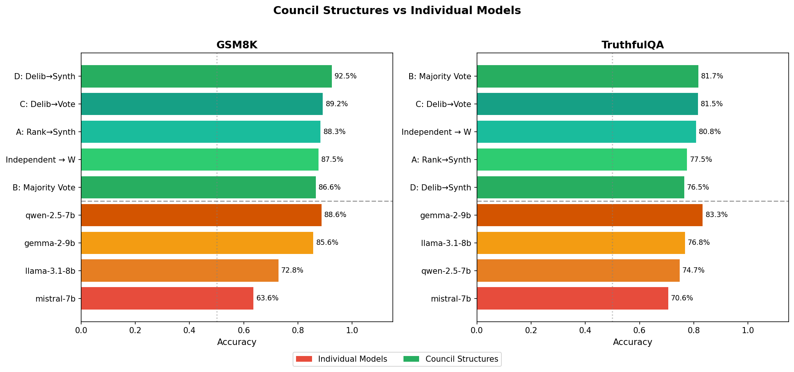

# LLM Council Governance Study

An experimental framework comparing different governance structures for LLM councils. Extends [Karpathy's llm-council](https://github.com/karpathy/llm-council) concept with multiple governance implementations and a rigorous evaluation harness.

## Motivation

Karpathy proposed and built an "llm council" to advise a user. This raises an interesting governance question: what is the optimal procedure for this council to adopt? To what extent should the council deliberate and learn from one another, vs. to what extent should the council vote based on each llm's private information? The goal of this research is to start testing different governance structures and see which arrives at superior decisions.

## Key Finding

**Simple majority voting outperforms more complex deliberation structures** for small LLMs (7-9B parameters).

| Structure | Accuracy | Time/Trial |
|-----------|----------|------------|
| **Majority Vote** | **81.7%** | 13.2s |
| Deliberate → Vote | 79.5% | 30.1s |
| Deliberate → Synthesize | 78.3% | 21.6s |
| Rank → Synthesize | 74.6% | 18.5s |

### Why?

Deliberation introduces **groupthink**. When models see each other's answers:
- Agreement increases from 76% → 87%
- Confidently wrong answers become persuasive
- Correct minority opinions get drowned out

Meanwhile, majority voting preserves the **independence** that makes "wisdom of crowds" work.

## The Four Governance Structures

| Structure | Stage 1 | Stage 2 | Stage 3 |
|-----------|---------|---------|---------|
| **A: Rank→Synthesize** | 4 models answer independently | Each model ranks all answers | Chairman synthesizes based on rankings |
| **B: Majority Vote** | 4 models answer independently | — | Take majority vote |
| **C: Deliberate→Vote** | 4 models answer independently | Each model sees others' answers, can revise | Take majority vote |
| **D: Deliberate→Synthesize** | 4 models answer independently | Each model sees others' answers, can revise | Chairman synthesizes |

## Results

### Councils vs Individual Models

The "wisdom of crowds" effect is dramatic. Individual 7-9B models achieve only 18-52% accuracy, but combining them into a council achieves 75-82%:



### Deliberation Analysis

Models change their answers ~21% of the time after deliberation:
- **+241** answers fixed (wrong → correct)
- **-116** answers broken (correct → wrong)
- **Net: +125** (positive but not enough to beat simple voting)

The best individual model (Gemma) abandons correct answers 15% of the time when it sees other models' responses.

## Setup

```bash
# Clone the repo
git clone https://github.com/YOUR_USERNAME/llm-council-governance.git
cd llm-council-governance

# Install dependencies
pip install -e .

# Configure API key
cp .env.example .env
# Edit .env and add your OpenRouter API key from https://openrouter.ai/keys

# Verify setup
python scripts/check_setup.py
```

## Usage

### Run the pilot study

```bash
# Run with cheap models (~$3-5, 6-7 hours)
python -m experiments.run_pilot

# Analyze results
python -m experiments.analyze_pilot
```

### Configuration

Edit `.env` to switch between cheap and frontier models:

```bash
# Cheap models for testing (~$3-5)
USE_CHEAP_MODELS=true

# Frontier models for production (~$80-150)
USE_CHEAP_MODELS=false
```

**Cheap models** (default):
- meta-llama/llama-3.1-8b-instruct
- mistralai/mistral-7b-instruct
- google/gemma-2-9b-it
- qwen/qwen-2.5-7b-instruct

**Frontier models**:
- openai/gpt-4.1
- google/gemini-2.5-pro-preview
- anthropic/claude-sonnet-4
- x-ai/grok-3

## Project Structure

```
├── backend/
│   ├── config.py              # Model and API configuration
│   ├── openrouter.py          # OpenRouter API client
│   ├── governance/
│   │   ├── base.py            # GovernanceStructure ABC
│   │   ├── utils.py           # Answer extraction, voting
│   │   ├── independent_rank_synthesize.py  # Structure A
│   │   ├── structure_b.py     # Majority Vote
│   │   ├── structure_c.py     # Deliberate → Vote
│   │   └── structure_d.py     # Deliberate → Synthesize
│   └── evaluation/
│       ├── base.py            # Benchmark ABC
│       ├── gsm8k.py           # Math reasoning benchmark
│       └── truthfulqa.py      # Factual accuracy benchmark
├── experiments/
│   ├── run_pilot.py           # Experiment runner
│   ├── analyze_pilot.py       # Analysis and visualization
│   └── results/               # Output data and charts
├── tests/                     # Test suite
└── scripts/
    └── check_setup.py         # Setup verification
```

## Benchmarks

- **GSM8K**: Grade school math word problems (86% council accuracy)
- **TruthfulQA**: Factual questions testing resistance to common misconceptions (71% council accuracy)

## Running Tests

```bash
pytest tests/ -v
```

## License

MIT

## Acknowledgments

- Inspired by [Andrej Karpathy's llm-council](https://github.com/karpathy/llm-council)
- Uses [OpenRouter](https://openrouter.ai/) for multi-model API access
- Benchmarks from [GSM8K](https://github.com/openai/grade-school-math) and [TruthfulQA](https://github.com/sylinrl/TruthfulQA)
